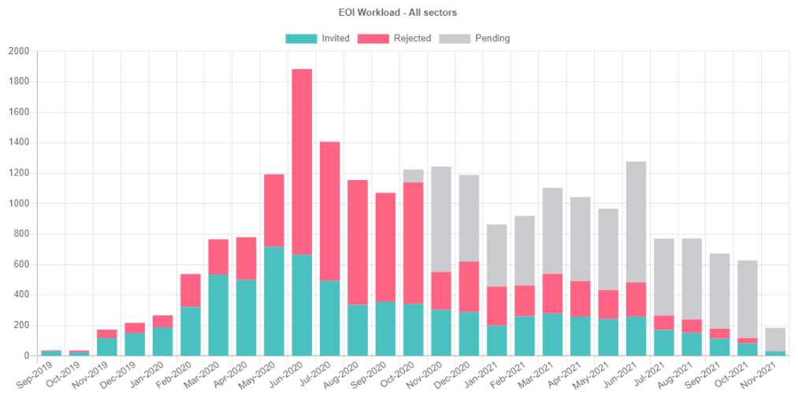

# GTI Insight

This is an interactive chart giving insight into the  Expression Of Interests (EOI) workload for the **[Global Talent Visa](https://immi.homeaffairs.gov.au/visas/working-in-australia/visas-for-innovation/global-talent-independent-program)** by the Department of Home Affairs (DHA).

## 🌍 Hosted at

[https://yellow-plant-089671c00.azurestaticapps.net/](https://yellow-plant-089671c00.azurestaticapps.net/)

## 🔧 Technologies used

- C#
- .NET. Blazor WebAssembly

## 📈 Data sources

- [FA 21/11/00439](https://www.homeaffairs.gov.au/foi/files/2021/fa-211100439-document-released.PDF) 📆 9 November 2021
- [FA 21/07/00057](https://www.homeaffairs.gov.au/foi/files/2021/fa-210700057-document-released.PDF) 📆 25 June 2021

## 👤 Author

- Jeffrey van der Stad

## 🗒️ Notes

- If any metric value is below 5, DHA does not provide an exact value
- This application is not affiliated with DHA in any form or way

## ⚠️ Disclaimer

- The author does not guarantee, and accepts no legal liability whatsoever arising from, or connected to, the use of any material contained on this website or on any linked site.
- The author recommends that users exercise their own skill and care with respect to their use of this website and that users carefully evaluate the accuracy, currency, completeness and relevance of the material on this website for their purposes.
- This website is not a substitute for independent professional advice and users should obtain any appropriate professional advice relevant to their particular circumstances.
